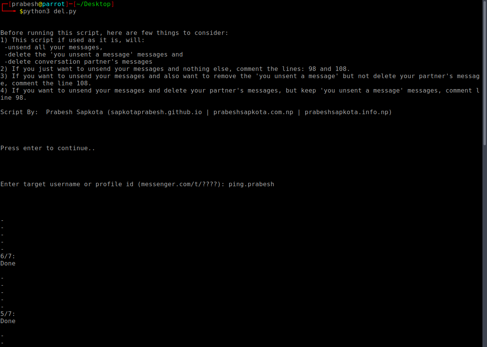

This script is still in beta version, not because its not working well but because its hard to setup for the first time. But once you set it up, you are ready to go. I will improve this script to set it up by itself in future.



# Setup

To set it up, you will need to provide 4 values to the script so that this script could perform actions on behalf of you. They are : c_user, xs, fb_dtsg and doc_id. These values doesn't change until your cookie renews. Here's how you could obtain them:

The value of user and xs can be found in cookies by name c_user and xs respectively.
The dtsg value can be obtained by running this code in messenger.com's console:
```
var dtsg = require('DTSG').getToken();
  alert('Your fb_dtsg token: ' + dtsg);
  ```

Obtaining doc value is bit hard and this is why I call this script a beta version. But after you got once, it never changes so its worth it.
To get doc_id value, simply intercept browser's req with burp and browse messenger.com. Then keep forwarding around 40-50 reqs until you get this kinda POST req  to /api/graphqlbatch/ with its data containing batch_name=MessengerGraphQLThreadFetcher:
<br>

[][sample]

<a href="https://github.com/TheBinitGhimire">@TheBinitGhimire</a>,<a href="https://www.facebook.com/nepolian.pratik">@nepolian.pratik</a>, <a href="https://github.com/santoshbrl5/">@santoshbrl5</a>, <a href="https://github.com/roopeshach">@roopeshach</a><br>
Thank you guys for helping me out =)

# Alternative

Alternatively, you can simply paste this script in messenger.com's console:
```
function ok(){
threedots = document.querySelectorAll("._8sop");
threedotslast = threedots[threedots.length - 1];
threedotslast.click();
removebutton = document.querySelector("._hw5");
removebutton.click();
unsendbutton = document.querySelectorAll("._3quh")[1];
unsendbutton.click();
setTimeout( ok, 1000 );
}
ok(1);
```
Ofcourse, it is limited and has many issues.

# License

[](http://creativecommons.org/licenses/by-nc/4.0/)

[sample]: https://ibb.co/GMgDJvg
